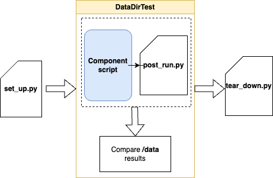

# Data Dir Test #

This library enables functional testing for Keboola components and processors by comparing expected and 
real output directories.

[](https://github.com/keboola/datadirtest/actions/workflows/ci.yml)

## Quickstart

### Installation

```bash
# Basic installation
pip install keboola-datadirtest

# With VCR support (HTTP recording/replay)
pip install "keboola-datadirtest[vcr]"

# With all features
pip install "keboola-datadirtest[all]"
```

### Use of the library ###

In the tests folder create a directory structure mimicking the directory structure in production:

```
/path/to/project/tests
└─functional
    └─test-name
      ├─expected-code
      ├─expected
      │ └─data
      │   └─out
      │     ├─files
      │     └─tables
      ├─source
      │ └─data
      │   ├─ config.json
      │   ├─ set_up.py
      │   ├─ tear_down.py
      │   └─in
      │     ├─files
      │     ├─tables            
```

- `source` - contains data folder that would be on the input of the component
    - it may contain `set_up.py` and `tear_down.py` scripts that are executed before and after each test respectively.
- `expected` - contains data folder that is result of the execution against the `source` folder. 
Include only folder that contain some files, e.g. `expected/files/out/file.json` 

The `DataDirTester` looks for the `component.py` script and executes it against the specified source folders, 
the `component.py` should expect the data folder path in the environment variable `KBC_DATADIR`.

By default it looks for the script at this path:
```
/path/to/project
└─src
    └─component.py
```

Then create file `test_functional.py` in the `/path/to/project/tests` folder and input the following:

```python
import unittest

from keboola.datadirtest import DataDirTester


class TestComponent(unittest.TestCase):

    def test_functional(self):
        functional_tests = DataDirTester()
        functional_tests.run()


if __name__ == "__main__":
    unittest.main()
```

### Parameters for Debugging
The `DataDirTester` class accepts the following parameters:
- `save_output` (default: `False`): If `True`, the resulting data folders are saved in the `output` folder.
- `selected_tests` (list of `str`): If set, only the tests with the specified names are executed.

Both parameters can also be passed via environment variables: `DIRTEST_SAVE_OUTPUT` and `DIRTEST_SELECTED_TESTS` (comma-separated names).
Then run your tests as usual e.g. via `python -m unittest discover` from the root folder.


**Alternatively** run as:

```
python -m datadirtest /path/to/project/tests/functional [optionally path/to/project/script.py]
```

### Environment Variables

It is possible to use environment variables placeholders inside the test `config.json`. 
To do so use following syntax: `{{env.VARIABLE_NAME}}`. The environment variable `VARIABLE_NAME` will be expected and it's value will replace the placeholder. 
If the EVN variable is not present, the test will fail.

**Example**
```json
{
  "parameters": {
    "#api_key": "{{env.API_KEY}}",
    "since": "1 day ago"
  }
}
```

In the following example the `#api_key` value will be replaced by `API_KEY` ENV variable value.


## Advanced usage

In some cases you want to modify the DataDirTest behaviour for instance to prepare the environment for each test, 
or execute some script prior the actual test run.

To achieve this you may extend the `datadirtest.TestDataDir` class. This class is a Test container for each of the 
test data folders and are being triggered as a part of a test suite via `DataDirTester.run()` method.

The `DataDirTester` class takes two additional arguments that allow to specify both the class extending the `DataDirTester` 
with additional functionality and also a context (parameters) that are passed to each `DataDirTester` class instance.

- `test_data_dir_class: Type[TestDataDir]` - a class with additional functionality to execute datadir tests. E.g. `MyCustomDataTest(TestDataDir)`
- `context_parameters` - a dictionary with arbitrary context parameters that are then available in each `TestDataDir` instance 
via `TestDataDir.context_parameters` 

** Example:**

The below code instantiates a pseudo SqlClient and runs the same sequence of queries before each DataDirtest execution.


```python
import unittest

from keboola.datadirtest import DataDirTester, TestDataDir

class CustomDatadirTest(TestDataDir):
    def setUp(self):
        sql_client = self.context_parameters['sql_client']
        sql_client.run_query('DROP TABLE IF EXISTS T;')
        sql_client.run_query('CREATE TABLE T AS SELECT 1 AS COLUMN;')


class TestComponent(unittest.TestCase):

    def test_functional(self):
        sql_client = SqlClient("username", "password", "localhost")
        
        functional_tests = DataDirTester(test_data_dir_class=CustomDatadirTest,
                                         context_parameters={'sql_client': sql_client})
        functional_tests.run()


if __name__ == "__main__":
    unittest.main()
```

### Using set_up, post_run and tear_down scripts

You may specify custom scripts that are executed before or after the test execution. Place them into the `source` folder:

```
      ├─source
      │ └─data
      │   ├─ config.json
      │   ├─ set_up.py
      │   ├─ post_run.py
      │   ├─ tear_down.py
      │   └─in
      │     ├─files
      │     ├─tables            
```

**Usage**

Each script (`set_up.py`, `post_run.py` and `tear_down.py`) **must implement** a `run(context: TestDataDir)` method. The `context` parameter then includes the parent
TestDataDir instance with access to `context_parameters` if needed. Both script files are optional. If file is found but there is no `run()` method defined,
the execution fails.

The `set_up.py` and `tear_down.py` are executed before and after the DataDirTest itself. The `post_run.py` is useful to run a script right after the component script, before the resulting data is modified. See the diagram below:



For instance, the `set_up.py` may contain following code:

```python
from keboola.datadirtest import TestDataDir


def run(context: TestDataDir):
    # get value from the context parameters injected via DataDirTester constructor
    sql_client = context.context_parameters['sql_client']
    sql_client.run_query('DROP TABLE IF EXISTS T;')
    sql_client.run_query('CREATE TABLE T AS SELECT 1 AS COLUMN;')
    print("Running before script")
```

It will run the above script specific for the current test (folder) before the actual test execution


### Chained tests

Chained tests are useful in scenarios when it is necessary to run several tests in a sequence and pass the component state between them.


You can chain tests by including them in additional folder that contains normal tests. 
The folder can also contain the `set_up` and `tear_down` scripts that will be executed before and after the group of chained tests. 
They also share all the other parameters like context.

e.g.: 

```
/path/to/project/tests
└─functional
    ├─my-chained-test
    │ ├─ set_up.py
    │ ├─ tear_down.py
    │ ├─01-first-test
    │ │  ├─expected
    │ │  │ └─data
    │ │  ├─source
    │ │  │ └─data  
    │ └─02-second-test
    │    ├─expected
    │    └─source 
    └─another-normal-test
```

#### The chain test execution

The tests are executed in **alphabetical order** so it's recommended to prefix your tests with numbers, e.g. `01_`,`02_`, ..

The execution flow of the example `my-chained-test` looks like this:

1. run root `set_up.py`
2. run `01-first-test`
3. pass `01-first-test` result `out/state.json` to `02-second-test/source/data/in/state.json`
   - If `02-second-test/source/data/in/state.json` alredy exists it is overridden!
4. run `02-second-test`
5. run `tear_down_py`

Note that the tests in the `functional` folder are executed in random order.

---

## VCR Integration (HTTP Recording/Replay)

The VCR module enables recording and replaying HTTP interactions, making tests:
- **Deterministic** - Same responses every time
- **Fast** - No real HTTP calls during replay
- **CI-friendly** - No credentials needed in CI/CD pipelines

### Installation

```bash
# Install with VCR support
pip install keboola-datadirtest[vcr]

# Install with pytest support
pip install keboola-datadirtest[pytest]

# Install all features
pip install keboola-datadirtest[all]
```

### Quick Start

#### 1. Record HTTP interactions (run locally with credentials)

```bash
python -m datadirtest tests/functional src/component.py --record
```

This creates cassette files in `source/data/cassettes/requests.json` for each test.

#### 2. Replay in CI (no credentials needed)

```bash
python -m datadirtest tests/functional src/component.py
```

By default, VCR automatically replays if cassettes exist.

### Test Structure with VCR

```
tests/functional/
└── test_api_extraction/
    ├── source/
    │   └── data/
    │       ├── config.json              # Config with placeholders
    │       ├── config.secrets.json      # Real credentials (gitignored)
    │       ├── cassettes/
    │       │   └── requests.json        # Recorded HTTP interactions
    │       └── sanitizers.py            # Optional custom sanitizers
    └── expected/
        └── data/
            └── out/
                └── tables/
                    └── main.csv
```

### Secrets Management

Create `config.secrets.json` (add to `.gitignore`) with real credentials:

```json
{
  "token": "real_api_key_here",
  "password": "secret_password"
}
```

In `config.json`, use placeholders:

```json
{
  "parameters": {
    "#token": "{{secret.token}}",
    "#password": "{{secret.password}}"
  }
}
```

During recording, secrets are automatically merged and sanitized from cassettes.

### CLI Reference

```bash
# Run with auto mode (replay if cassettes exist)
python -m datadirtest tests/functional src/component.py

# Record new cassettes
python -m datadirtest tests/functional src/component.py --record

# Force replay (fail if no cassettes)
python -m datadirtest tests/functional src/component.py --replay

# Update existing cassettes
python -m datadirtest tests/functional src/component.py --update-cassettes

# Run without VCR (original behavior)
python -m datadirtest tests/functional src/component.py --no-vcr

# Run specific tests
python -m datadirtest tests/functional src/component.py --tests test_basic,test_advanced

# Verbose output with full diffs
python -m datadirtest tests/functional src/component.py --verbose

# Custom freeze time
python -m datadirtest tests/functional src/component.py --freeze-time 2024-06-15T10:00:00
```

### Python API

```python
from keboola.datadirtest import VCRDataDirTester

# Run with automatic VCR
tester = VCRDataDirTester(
    data_dir='tests/functional',
    component_script='src/component.py',
    vcr_mode='auto'  # 'record', 'replay', or 'auto'
)
tester.run()
```

### Custom Sanitizers

Create `source/data/sanitizers.py` to customize how sensitive data is redacted:

```python
from keboola.datadirtest.vcr import BaseSanitizer

class AccountIdSanitizer(BaseSanitizer):
    def before_record_request(self, request):
        # Replace account IDs in URLs
        request.uri = request.uri.replace("act_123456", "act_REDACTED")
        return request

def get_sanitizers(config: dict) -> list:
    """Return sanitizers for this test."""
    return [AccountIdSanitizer()]
```

### Scaffolding Tests

Generate test folders from a definitions file:

```bash
# Create test structure and record cassettes
python -m datadirtest scaffold definitions.json tests/functional src/component.py

# Create structure only (no recording)
python -m datadirtest scaffold definitions.json tests/functional --no-record
```

Example `definitions.json`:

```json
[
  {
    "name": "test_basic_extraction",
    "config": {
      "parameters": {"endpoint": "/api/data"}
    },
    "secrets": {"token": "real_api_key"},
    "description": "Basic extraction test"
  }
]
```

### Pytest Integration

Add to your `conftest.py`:

```python
pytest_plugins = ["keboola.datadirtest.vcr.pytest_plugin"]
```

Run with pytest:

```bash
# Auto mode
pytest tests/

# Record mode
pytest tests/ --vcr-record

# Replay mode (strict)
pytest tests/ --vcr-replay
```

### Best Practices

1. **Always gitignore secrets**: Add `config.secrets.json` to `.gitignore`
2. **Commit cassettes**: Cassettes should be committed to version control
3. **Re-record when API changes**: Use `--update-cassettes` when APIs change
4. **Use meaningful test names**: Helps identify which cassette belongs to which test
5. **Review cassettes**: Check that no sensitive data leaked into recordings